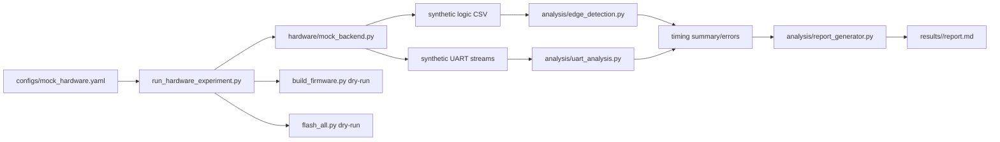

# 2A2T UWB 코드·실험 가이드

## 1. 이 문서의 범위

이 저장소는 DW3000/DWS3000 보드를 연결하기 전, 향후 A1/A2/T1/T2 실험을 안전하게 준비하기 위한 **pre-hardware 환경**이다.

현재 검증된 것은 Python 도구, mock backend, synthetic fixture, 분석기, dry-run orchestration이다. 다음 문구가 붙은 숫자는 실제 보드 결과가 아니다.

```text
source_type = SYNTHETIC
hardware_verified = false
```

현재 baseline firmware는 `TG`와 `A1/B2`를 번갈아 사용하는 2-anchor/1-tag overlay다. A1/A2/T1/T2 실제 packet codec, scheduler, RF 동작은 아직 구현하거나 확인하지 않았다.

## 2. 전체 코드 구조

| 경로 | 역할 | 현재 상태 |
|---|---|---|
| `firmware_overlay/` | 기존 DS-TWR overlay source | 보존만 함; 수정하지 않음 |
| `firmware/instrumentation/` | GPIO/timing trace abstraction | host test 통과, vendor project 미통합 |
| `hardware/` | Flash/UART/logic analyzer HAL과 backend | mock 완성, real adapter는 guarded |
| `analysis/` | logic edge, UART, timing, CIR, calibration 분석 | synthetic fixture로 검증 |
| `experiments/` | run manifest, stage 정의, experiment helper | mock/dry-run 검증 |
| `tools/` | CLI entry point | 환경검사, runner, calibration, capture, build/flash plan |
| `configs/` | mock 및 실제 장비 입력 template | 실제 config는 TODO 해소 필요 |
| `schemas/` | YAML/JSON config 계약 | unit test 검증 |
| `tests/` | unit/integration test | 보드 없이 실행 가능 |
| `artifacts/` | baseline evidence 및 pre-hardware assessment | code inspection/dry-run evidence |



## 3. 핵심 코드가 하는 일

### 3.1 Hardware abstraction layer

`hardware/interfaces.py`는 Flash, Serial, Logic backend가 지켜야 할 공통 interface와 결과 provenance 계약을 정의한다.

- `hardware/mock_backend.py`: 네 board(A1/A2/T1/T2), UART, logic edge, flash plan을 deterministic하게 만든다. corruption, timeout, retry, missing link, IRQ outlier 같은 fault injection도 제공한다.
- `hardware/jlink_backend.py`: J-Link command/script를 만들며, `execute=True`와 YAML의 boolean `jlink.allow_execute: true`가 동시에 있어야만 실제 실행을 허용한다.
- `hardware/serial_backend.py`: pyserial 기반 raw binary capture adapter다.
- `hardware/sigrok_backend.py`: sigrok-cli command builder와 sampled CSV → canonical edge CSV 변환기다.
- `hardware/saleae_backend.py`: dependency/plan 단계만 제공하는 skeleton이다.

실제 backend는 장비 없이 성공처럼 보이지 않도록 guard되어 있다. 예를 들어 unified real runner는 현재 UART-only connection smoke로 제한된다.

### 3.2 Firmware instrumentation abstraction

`firmware/instrumentation/trace_events.h`에는 IRQ, ISR, SPI status/frame/CIR, UART enqueue/TX, phase/filter, frame start/end 등 trace event가 정의되어 있다.

`trace_gpio.*`와 `timing_probe.*`는 다음 목적을 가진다.

- pin mapping이 없어도 compile 가능한 null backend 제공
- trace enable이 꺼졌을 때 RF path에 영향을 주지 않는 no-op 제공
- GPIO pulse와 software timestamp를 같은 event 이름으로 기록할 수 있게 함
- ISR 안에서 blocking log/stdio/sleep를 호출하지 않도록 분리

이 코드는 현재 vendor DW3000 project에 연결되지 않았다. 실제 trace pin, polarity, callback 및 overhead는 보드별로 별도 검증해야 한다.

### 3.3 Timing/UART 분석기

- `analysis/edge_detection.py`: rising/falling edge를 pair하고, missing fall, overlap, invalid pair, marker 기반 frame segmentation, warm-up 제외, statistical outlier를 기록한다.
- `analysis/timing_statistics.py`: mean, median, standard deviation, p90/p95/p99/max를 계산한다.
- `analysis/uart_analysis.py`: U2AT framing, CRC 오류 복구, parse error, timeout/retry/missing-link record를 분석한다.
- `analysis/report_generator.py`: 환경검사, runner stage, timing table, synthetic fault/omission count, unresolved item을 Markdown report로 만든다.

### 3.4 Antenna-delay dry-run

`analysis/antenna_delay_fit.py`는 세 dry-run mode를 제공한다.

1. `COMBINED_SINGLE_LINK`: synthetic combined-delay 후보를 coarse-to-fine으로 탐색한다.
2. `REFERENCE_NODE_SEQUENTIAL`: reference node를 고정한 synthetic 순차-node branch를 실행한다.
3. `OFFLINE_2A2T_LEAST_SQUARES`: 네 link의 synthetic bias에 least-squares fit을 적용한다.

이 계산은 sample/warm-up 수, objective 종류, repeatability penalty, seed/noise를 config에서 읽는다. 하지만 output은 firmware에 쓸 수 없는 synthetic token이며 `calibration_completed=false`다.

## 4. 보드 없이 실행하는 mock 실험

repository root에서 실행한다.

```bash
python tools/check_environment.py

python tools/run_hardware_experiment.py \
  --config configs/mock_hardware.yaml \
  --experiment timing_characterization \
  --backend mock \
  --dry-run \
  --analyze \
  --report

python tools/calibrate_antenna_delay.py \
  --config configs/antenna_calibration.example.yaml \
  --backend mock \
  --dry-run
```

mock run은 고유한 `results/YYYY-MM-DD_<experiment>_mock_pre-hardware_runNN_<id>/`에 저장된다. 기존 raw output을 덮어쓰지 않는다.

### 4.1 Unified timing runner의 14단계

| 순서 | Stage | mock에서 하는 일 |
|---:|---|---|
| 1 | `VALIDATE_CONFIG` | schema/provenance/dry-run 조건 확인 |
| 2 | `CHECK_ENVIRONMENT` | Python, package, repo, mock 환경 확인 |
| 3 | `DISCOVER_DEVICES` | synthetic A1/A2/T1/T2 inventory 생성 |
| 4 | `BUILD` | 네 role의 image mapping plan 생성 |
| 5 | `FLASH` | flash order/failure policy mock 실행 |
| 6 | `RESET_AND_SYNC` | synthetic reset 순서 기록 |
| 7 | `START_LOGIC_CAPTURE` | synthetic logic edge CSV 생성 |
| 8 | `START_UART_CAPTURE` | 네 synthetic UART raw stream 생성 |
| 9 | `RUN_EXPERIMENT` | experiment/fault summary 기록 |
| 10 | `STOP_CAPTURE` | backend close 상태 기록 |
| 11 | `VALIDATE_RAW_DATA` | raw file 존재·non-empty 확인 |
| 12 | `ANALYZE` | timing/UART table과 errors 생성 |
| 13 | `GENERATE_REPORT` | Markdown report 생성 |
| 14 | `ARCHIVE` | unresolved item 및 run manifest 보존 |

### 4.2 Mock fault를 바꾸는 방법

`configs/mock_hardware.yaml`의 `mock.faults`를 수정하면 실패/오류 경로를 재현할 수 있다.

| 설정 예 | 재현되는 상황 |
|---|---|
| `flash_fail_nodes: [A2]` | A2 simulated flash failure |
| `missing_com_nodes: [T2]` | T2 UART 미발견 |
| `uart_corruption_probability: 0.01` | UART corrupt record |
| `uart_buffer_overflow: true` | UART overflow marker |
| `missing_logic_channels: [CIR_READ]` | CIR metric 누락 |
| `irq_outlier_probability: 0.01` | IRQ latency outlier |
| `packet_timeout_probability: 0.01` | packet timeout |
| `retry_probability: 0.02` | retry count 증가 |
| `missing_link_probability: 0.02` | link-present false |

seed는 `mock.random_seed`로 고정한다. mock의 baud, sample rate, timing distribution은 실제 장비 설정값으로 복사하면 안 된다.

## 5. 결과를 읽는 방법

Timing run에서는 다음 파일을 우선 본다.

| 파일 | 내용 |
|---|---|
| `run_manifest.json` | backend, commit, config hash, 단계별 상태/시간 |
| `environment_report.json` | PASS/SKIP/FAIL 환경검사 상세 |
| `raw/logic/logic_edges.csv` | 원본 synthetic logic edge |
| `raw/uart/*.bin` | node별 raw UART stream과 metadata sidecar |
| `intermediate/edge_pairs.csv` | pair된 pulse table |
| `analysis/timing_summary.csv` | timing metric 통계 |
| `analysis/errors.csv` | missing/overlap/outlier 등 logic 오류 |
| `analysis/uart_errors.csv` | UART parser error |
| `report.md` | 사람이 읽는 종합 보고서 |

Calibration run에서는 `analysis/calibration/` 아래의 `calibration_candidates.csv`, `mock_bias_table.csv`, `objective_curve.csv`, `calibration_result.json`을 본다.

## 6. A1/A2/T1/T2 build·flash dry-run

```bash
python tools/build_firmware.py \
  --config configs/mock_hardware.yaml \
  --dry-run \
  --output artifacts/pre_hardware/build_dry_run

python tools/flash_all.py \
  --config configs/mock_hardware.yaml \
  --build-manifest artifacts/pre_hardware/build_dry_run/build_manifest.json \
  --dry-run \
  --output artifacts/pre_hardware/flash_plan.json
```

이 명령은 `anchor_a1`, `anchor_a2`, `tag_t1`, `tag_t2` mapping과 reset order만 검증한다. compiler, J-Link, image file, board를 실행·접근하지 않는다.

## 7. 실제 장비 연결 후 권장 실험 순서

### 7.1 입력값 준비

1. `configs/local_hardware.example.yaml`을 `configs/local_hardware.yaml`로 복사한다.
2. A1/A2/T1/T2 J-Link ID, UART port, baud, target/device/interface를 채운다.
3. logic analyzer connection ID, channel map, sample rate, GPIO polarity를 채운다.
4. `configs/antenna_calibration.example.yaml`을 `configs/antenna_calibration.yaml`로 복사한다.
5. calibration의 target node/link, 기준거리·불확도, 안테나 기준점·높이·방향·환경, 실제 search range를 채운다.

상세 입력표와 안전 순서는 [HARDWARE_CONNECTION_CHECKLIST.md](HARDWARE_CONNECTION_CHECKLIST.md)를 따른다.

### 7.2 첫 connection smoke

```bash
python tools/discover_hardware.py --config configs/local_hardware.yaml

python tools/run_hardware_experiment.py \
  --config configs/local_hardware.yaml \
  --experiment connection_smoke_test \
  --backend real \
  --execute
```

이 smoke는 현재 네 configured UART port와 raw capture만 확인한다. RF ranging, J-Link physical enumeration, node identity/session, 2A2T 성공을 뜻하지 않는다.

### 7.3 Logic timing HIL 전 확인

실제 logic timing 실험 전에 다음을 확인한다.

- firmware instrumentation을 clean SDK build에 명시적으로 통합한다.
- trace GPIO가 boot strap/RF/기존 peripheral pin과 충돌하지 않는지 확인한다.
- analyzer input level, probe ground, channel label, sample rate를 확인한다.
- `IRQ_PIN`, `ISR_ACTIVE`, SPI/CIR/UART trace의 start/end 정의가 문서와 일치하는지 pilot capture로 확인한다.
- raw capture와 decoded edge CSV를 보존하고, timing 숫자를 `hardware_verified=true`로 바꾸기 전에 별도 acceptance를 통과시킨다.

현재 unified real runner는 logic/UART capture를 동시 처리하지 않는다. 따라서 현 상태의 real command를 동기 timing measurement로 해석하면 안 된다.

### 7.4 첫 antenna-delay readiness launch

```bash
python tools/calibrate_antenna_delay.py \
  --config configs/antenna_calibration.yaml \
  --hardware-config configs/local_hardware.yaml \
  --backend real \
  --execute
```

현재 이 명령은 clean SDK, build/image mapping, range-record contract, reference geometry가 준비되지 않으면 build/flash/measurement 전에 의도적으로 중단한다. 이 단계는 calibration 완료가 아니다.

## 8. 테스트

일반 환경:

```bash
python -m pytest -q
```

Visual Studio x64 developer environment에서는 instrumentation C compile/run을 포함한 전체 test를 실행할 수 있다. 일반 PowerShell PATH에는 C compiler가 없을 수 있으며, 그 경우 compiler-dependent test 한 개가 SKIP될 수 있다.

## 9. 현재 제한사항 요약

- 실제 DW3000/DWS3000 측정, flash, UART capture, logic analyzer capture는 수행하지 않았다.
- 실제 SPI/UART/IRQ/CIR 처리시간, antenna delay, RF ranging 성능은 확정되지 않았다.
- baseline repository는 overlay-only이며 clean full SDK가 필요하다.
- actual A2/T2 protocol, packet identity, scheduling, aggregation은 별도 firmware 작업이 필요하다.
- J-Link/logic physical discovery와 UART firmware identity parsing은 아직 자동화되지 않았다.

자세한 handoff와 위험 목록은 [HANDOFF.md](../HANDOFF.md), 실제 command 모음은 [EXPERIMENT_COMMANDS.md](EXPERIMENT_COMMANDS.md)를 참고한다.
